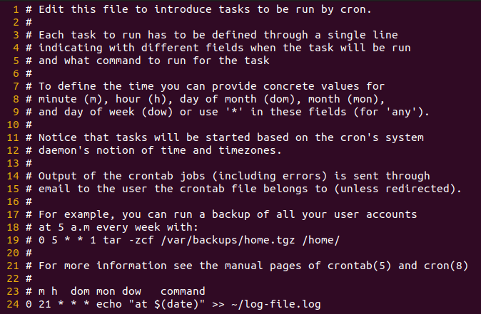

# Bash Scripting

## table of content

* [Where I store my scripts ](#a)
* [Standard Streams](#b)
* [scheduling Jobs](#c)
    * [Using the `at` command for script scheduling](#d)
    * [Automating tasks in Linux with `crontab`](#e)

### Where I store my scripts ? <a id="a"></a>

On most systems, some standard directories such as `/usr/local/bin`. Adding our script to any of these directories enables us to run the script from the command line. All users can use it from the command line

For scripts intended for personal use, we’d be better off putting them in a directory under our home directory, `~/.local/bin`.

> [!NOTE]  
> You can also make you own custom directory, add it to PATH variable, and then use the scripts under this directory from the command line.  
For example, let’s include `~/.my-scripts/bin`, in the PATH variable.

```bash
# make the script executable
chmod +x /home/user/.my-scripts/bin/your-script
# re-create new PATH variable
PATH=$PATH:/home/user/.my-scripts/bin
# set the PATH env with a new value
export PATH
```

Once we append this directory to the PATH variable, all the scripts and executables from this directory will be available for use from the command line.

> To avoid doing this on every reboot and make this addition permanent, we can run the above two commands automatically when the shell is initialized.

1. Apply `your/custom/directory/script` only to your user account

    ```bash
    nano ~/.bashrc
    ### Add this two lines ###
    +------------- [~/.bashrc] --------------+
    | PATH=$PATH:/home/user/.my-scripts/bin  |
    | export PATH                            |
    +----------------------------------------+
    ```

    `~/.bashrc`: This file is typically used for configuring the behavior of interactive shells. It's specific to Bash, and changes made here will affect only the user who owns the .bashrc file.

2. Applying `your/custom/directory/script` to all users account.

    ```bash
    sudo nano /etc/profile
    ### Add this two lines ###
    +------------ [etc/profile] -------------+
    | PATH=$PATH:/home/user/.my-scripts/bin  |
    | export PATH                            |
    +----------------------------------------+
    ```

    This is suitable if you want the changes to be system-wide, applying to all users.

Choose the location based on your specific requirements. For individual user configurations, `~/.bashrc` or `~/.profile` is often preferred. If you want a system-wide configuration, you might consider modifying `/etc/profile`.

### Standard Streams <a id="b"></a>

Three different types of streams exist called standard streams which are:

* The **standard input** `stdin`, that programs can read data from.
* The **standard output** `stdout`, that programs can write data to when a successful operation was performed.
* The **standard error** `stderr`, that programs can write data to when something goes wrong during execution.

That being said, whenever you launch a new terminal window, the operating system automatically opens for us to use the three standard streams stdin, stdout and stderr, always assigning them the same three file descriptors, which are:

* `0` for `stdin`
* `1` for `stdout`
* `2` for `stderr`

    1. Redirection Operators of Stdin, Stdout, and Stderr

        * The **<** or **0<** is used for the `stdin` stream.
        * The **>** or **1>** is used for the `stdout` stream.
        * The **2** is used for the `stderr` stream.

    2. Use Stdout and Stderr

        Redirect the success logs into **log/success.log**

        ```bash
        find /etc/ > log/success.log
        # it gonna output just the `stderr` because the `stdout` output in log/success.log
        ```

        Redirect the error log into **log/error.log**

        ```bash
        find /etc/ 2> log/error.log
        # it gonna output just the `stdout` because the `stderr` in log/error.log
        ```

        Redirect the error messages that come from `find /etc/` into **log/error.log** and redirect the success messages into **log/success.log**

        ```bash
        find /etc/ 2> log/error.log > log/success.log
        ```

        Also we can redirect the `stdout` and `stderr` in the same file

        ```bash
        find /etc/ &> log/find-command.log
        ```

### scheduling Jobs <a id="c"></a>

1. Using the ‘at’ command for script scheduling <a id="d"></a>

    In addition to cron, Linux also provides the `at` command for scheduling one-time tasks to be executed `at` a specific time.

    To schedule a task using the at command, you can use the following syntax:

    ```bash
    at 11:50 AM -f /path/to/your/script.sh
    ```

    * Verify with `atq` (at queue)

        ``` bash
        atq
        > 3	    Mon Jan 29 11:50:00 2024 a ilyasse
        ```

    * Remove the jobs in queue with `atrm`

        ```bash
        # syntax
        atrm <number_of_queue>
        # e.g,
        atrm 3
        ```

2. Automating tasks in Linux with `crontab` <a id="e"></a>

    In Linux, cron is a time-based job scheduler that allows you to schedule tasks to run automatically at specific times or intervals. It is a useful tool that comes pre-installed on most Unix-like systems.

    ```bash
    crontab -l
    crontab -e
    crontab -r
    ```

    * `-l`: Display the current user’s crontab.
    * `-e`: Edit the current user’s crontab.
    * `-r`: Remove the current user’s crontab.

    Run the command to install new crontab job.

    ```bash
    cronab -e
    # output: ---
    > no crontab for ilaysse

    > Select an editor.  To change later, run 'select-editor'.
    >  1. /bin/nano        <---- easiest
    >  2. /usr/bin/vim.basic
    >  3. /usr/bin/vim.tiny
    >  4. /bin/ed

    > Choose 1-4 [1]: <choose_your_favorite_text_editor>
    ```

    

    To execute backup.sh every day at 9:00 p.m. (21:00 hrs):

    ```bash
    0 21 * * * /path/to/your/script
    ### -- every 21:00 it gonna concatinate
    0 21 * * * /usr/bin/echo "at $(date) >> ~/log-file.log"
    ```

    ```bash
    # Display the current user’s crontab.
    crontab -l
    # or list jobs with specific user ---
    cronab -l -u ilyasse
    cronab -l -u root
    ```

    On the other hand, crontab refers to the file or data structure that contains the list of cron jobs or tasks. The crontab file is typically located in the `/var/spool/cron/crontabs` directory and is associated with a specific user.

    ```bash
    sudo ls -l /var/spool/cron/crontabs/
    > total 4
    > -rw------- 1 ilyasse crontab 1137 Jan 30 11:55 ilyasse
    ```
